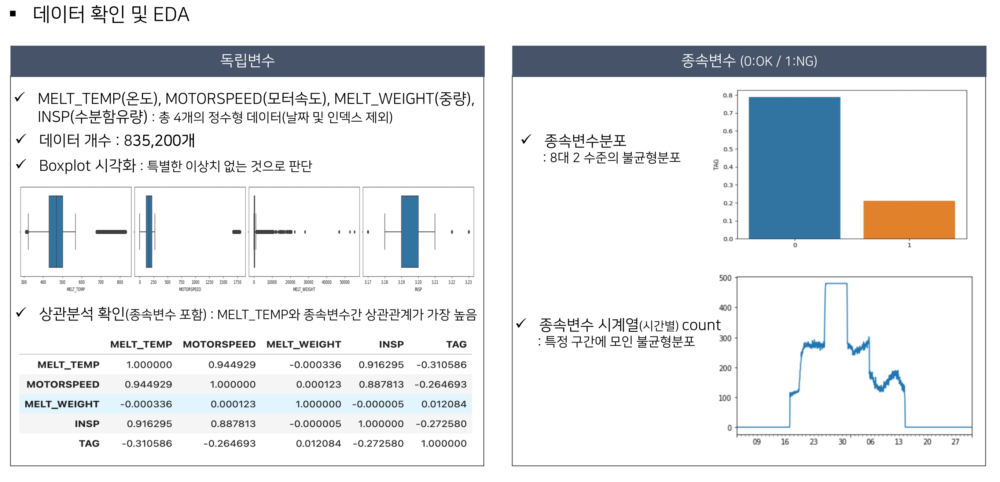
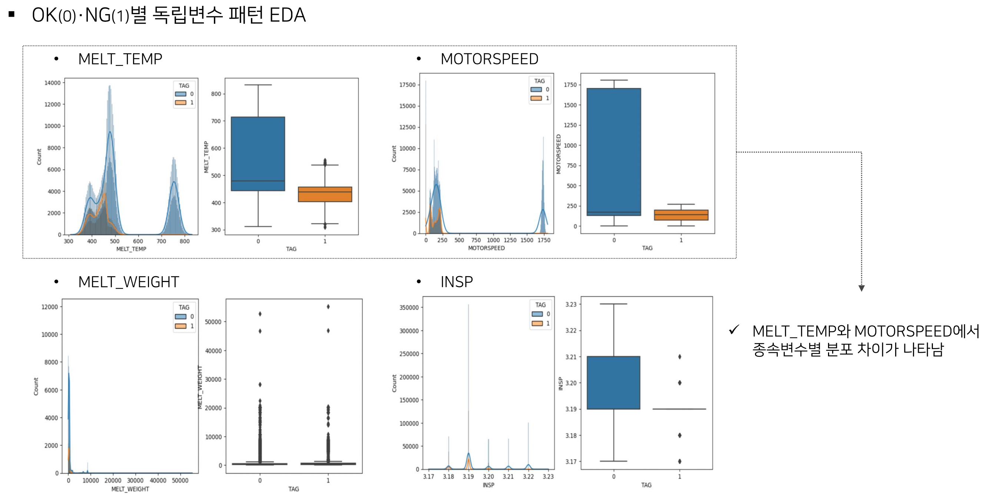
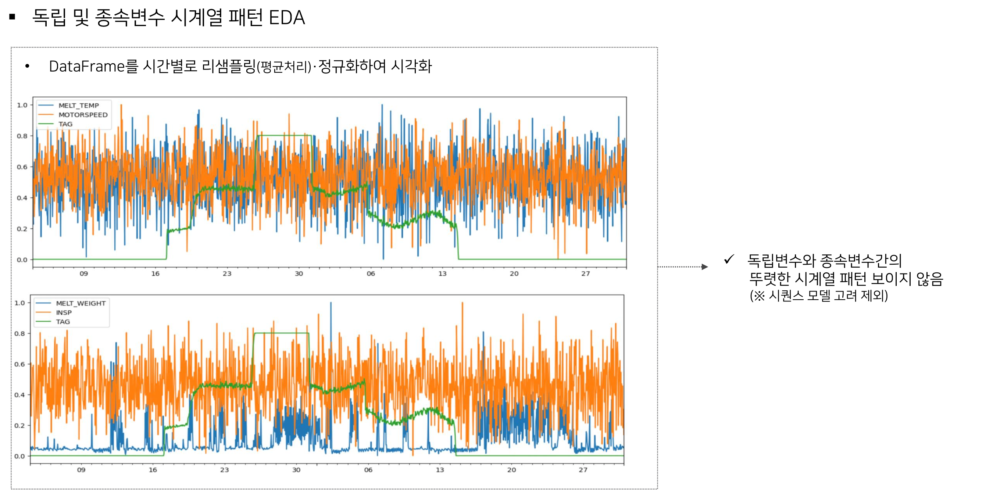
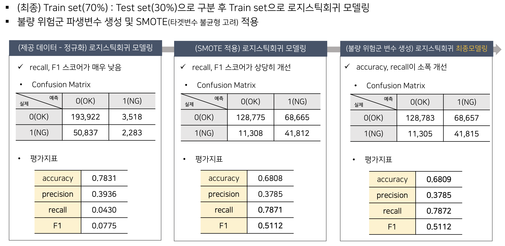

# 제2회 K-인공지능 제조데이터 분석 경진대회
SMOTE・불량 위험군 파생변수를 활용한 불량 예측시스템 및 수도레이블링을 통한 고도화방안

[이슈]
- 용해품질에 영향을 미치는 다양한 요인들이 항상 존재
- 용해품질을 유지를 위해 상황에 따른 적절한 운영값 설정 필요, 그러나 일반적으로 현장작업자의 경험과 노하우에 의존해 대처
- 인력 공백이 생기는 경우 대처가 어렵고, 품질 이상 수준이 높아지면 자원 손실까지 이어짐

[아이디어]
- 데이터를 기반으로 품질 이상을 미리 예측하는 불량 예측시스템을 구축
    - 불량이 예상될 경우 작업자에게 알리고 작업자는 적절한 설비운영값을 설정하여 최종 품질불량을 예방
    - 실시간으로 얻어지는 데이터를 활용하는 프로세스를 마련해 불량 예측시스템을 더 강건하게 만듦

[데이터] 
- 용해 공정 데이터 : 835,200개 
    1) STD_DT(object): 날짜, 시간 (수집일시)
    2) NUM(int64): 인덱스
    3) MELT_TEMP(int64): 용해 온도
    4) MOTORSPEED(int64): 용해 교반속도
    5) MELT_WEIGHT(int64): 용해탱크 내용량(중량)
    6) INSP(float64): 생산품의 수분함유량(%)
    7) TAG(object): 불량여부

[데이터 전처리]
- 인덱스, 시간 변수 제거
- 용해 온도와 용해탱크 내용량이 일정 조건을 만족했을 때 품질 이상 발생 확인
    - 해당 조건을 만족하는지를 판별할 수 있는 불량 위험군 변수(파생변수)를 생성

[데이터 파악]

[모델 구축]
- 로지스틱회귀 불량예방 시스템 모델링
    - 랜덤포레스트로 파생변수 생성 인사이트 도출
    - 불량 위험군 파생변수 생성 후 모델 학습
    - 로지스틱회귀 장점을 고려하여 해당 모델을 선택하여 모델링
    - 데이터 레이블이 불균형 하므로 모델 학습 시 SMOTE 기법을 적용 
    - 불량 위험군 파생변수를 추가 활용하여 성능 개선

- SMOTE 및 불량 위험군 변수를 통한 개선
    - (SMOTE 적용) recall, F1 소폭 개선
    - (불량 위험군 변수) accuracy, recall 소폭 개선

[모델고도화 방안] 
- 수도레이블링 적용하여 모델 고도화 프로세스 마련
    - 학습된 로지스틱회귀 모델의 예측 확률을 조정하여 더 민감하게 품질 이상으로 예측하도록 설정
    - 실시간으로 쌓이는 데이터를 민감한 모델로 예측하고 예측값을 레이블로 사용하여 모델을 계속해서 재학습 시킴
    - (수도레이블링 시뮬레이션) 수도레이블링을 통해 (precision 감소 대비) recall이 개선되는 효과

[주요 툴]
- (데이터 프로세싱) 판다스, 넘파이, 맷플롯립
- (모델 구축) 사이킷런

